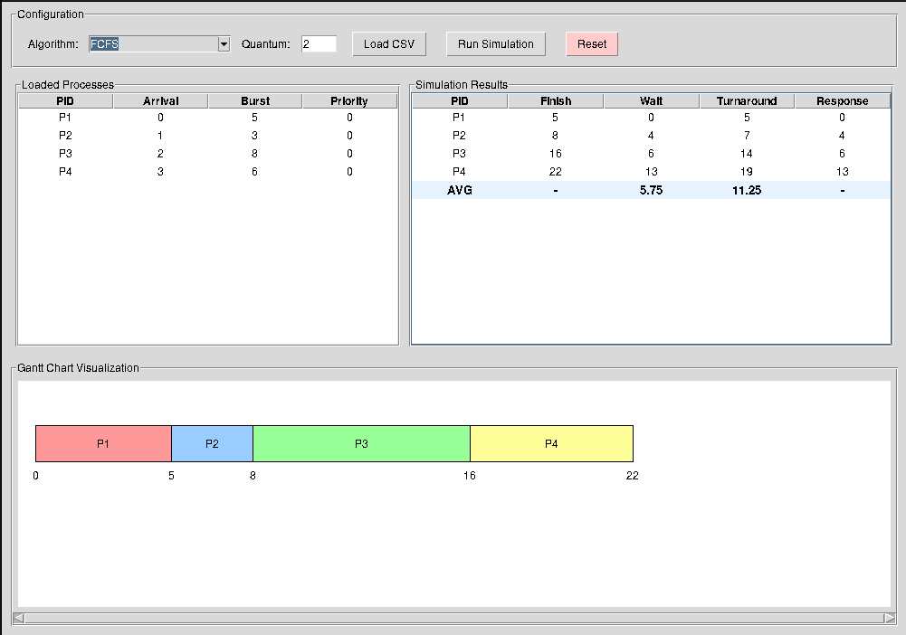

# CPU Scheduling Algorithm Simulator

A comprehensive Python-based simulator that implements and visualizes five CPU scheduling algorithms used in operating systems.

## 📋 Table of Contents
- [Project Overview](#project-overview)
- [Features](#features)
- [Setup Instructions](#setup-instructions)
- [Algorithms Implemented](#algorithms-implemented)
- [Usage](#usage)
- [Sample Input/Output](#sample-inputoutput)
- [Results Visualization](#results-visualization)
- [Project Structure](#project-structure)
- [Technical Details](#technical-details)
- [Comparison of Algorithms](#comparison-of-algorithms)
- [Future Enhancements](#future-enhancements)

## 🎯 Project Overview

This project simulates CPU scheduling algorithms to understand their behavior and performance characteristics. It processes a set of user-defined jobs through five different scheduling algorithms and provides comprehensive metrics for comparison.

**Key Objectives:**
- Implement and compare multiple CPU scheduling algorithms
- Visualize scheduling sequences using Gantt charts
- Calculate and compare performance metrics (waiting time, turnaround time, response time)
- Provide export functionality for analysis

## ✨ Features

- **Five Scheduling Algorithms**: FCFS, SJF (non-preemptive), SRT (preemptive), RR, MLFQ
- **CSV Input Support**: Load process data from CSV files
- **Gantt Chart Visualization**: ASCII-based timeline visualization
- **Performance Metrics**: Complete statistical analysis for each algorithm
- **Export Functionality**: Save results to CSV files for further analysis
- **Modular Design**: Clean separation between algorithms and UI

## 🚀 Setup Instructions

### Prerequisites
- Python 3.7 or higher
- No external dependencies required (uses only Python standard library) unless you what to start **gui** (pip install matplotlib)

### Installation

1. **Clone or download the project files:**
   ```
   git clone <repository-url>
   cd cpu-scheduling-simulator
   ```

2. **Verify file structure:**
   Ensure you have the following files in your directory:
   - `main.py` - Main program entry point
   - `scheduler.py` - All scheduling algorithm implementations
   - `process.py` - Process class definition
   - `input.csv` - Sample input data

3. **Prepare input file:**
   Modify `input.csv` with your process data or use the provided sample.

## 📊 Algorithms Implemented

### 1. **First-Come-First-Serve (FCFS)**
- **Type**: Non-preemptive
- **Logic**: Processes execute in order of arrival
- **Characteristics**: Simple but can lead to convoy effect
- **Implementation**: `solve_fcfs()` in `scheduler.py`

### 2. **Shortest Job First (SJF)**
- **Type**: Non-preemptive
- **Logic**: Executes process with smallest burst time next
- **Characteristics**: Minimizes average waiting time but requires knowledge of burst times
- **Implementation**: `solve_sjf()` in `scheduler.py`

### 3. **Shortest Remaining Time (SRT)**
- **Type**: Preemptive version of SJF
- **Logic**: Always runs process with smallest remaining time
- **Characteristics**: More responsive than SJF, optimal for minimizing turnaround time
- **Implementation**: `solve_srt()` in `scheduler.py`

### 4. **Round Robin (RR)**
- **Type**: Preemptive
- **Logic**: Each process gets fixed time quantum; cycled through ready queue
- **Characteristics**: Fair allocation, good response time
- **Parameters**: Configurable time quantum (default: 2)
- **Implementation**: `solve_rr()` in `scheduler.py`

### 5. **Multilevel Feedback Queue (MLFQ)**
- **Type**: Preemptive with feedback
- **Logic**: Three-level queue system with different scheduling policies
- **Queues**:
  - Queue 0: RR with quantum=2 (highest priority)
  - Queue 1: RR with quantum=4
  - Queue 2: FCFS (lowest priority)
- **Features**: Aging mechanism to prevent starvation
- **Implementation**: `solve_mlfq()` in `scheduler.py`

## 🖥️ Usage

### Running the Simulator

**Basic execution:**
```bash
python main.py
```

The program will:
1. Load processes from `input.csv`
2. Run all five scheduling algorithms sequentially
3. Display results for each algorithm in the console
4. Export results to CSV files in the `output_results/` directory

### Custom Input Format

Create a CSV file with the following columns:
```csv
pid,arrival_time,burst_time,priority
P1,0,5,0
P2,1,3,0
P3,2,8,0
P4,3,6,0
```

**Columns:**
- `pid`: Process identifier (string)
- `arrival_time`: Time when process arrives (integer)
- `burst_time`: CPU time required (integer)
- `priority`: Priority level (integer, used by MLFQ)

### Running Specific Algorithms

To run a specific algorithm, modify `main.py` to comment out unwanted algorithms or create a custom script:

```python
# Example: Run only FCFS and SJF
from scheduler import solve_fcfs, solve_sjf
from main import load_processes, print_results

processes = load_processes("input.csv")
fcfs_result, fcfs_gantt = solve_fcfs(processes[:])
print_results(fcfs_result, fcfs_gantt)

processes_sjf = load_processes("input.csv")
sjf_result, sjf_gantt = solve_sjf(processes_sjf)
print_results(sjf_result, sjf_gantt)
```

# 📝 Sample Input/Output

## Sample Input

**File: `input.csv`**
```csv
pid,arrival_time,burst_time,priority
P1,0,5,0
P2,1,3,0
P3,2,8,0
P4,3,6,0
```

**Process Details:**
- **P1**: Arrives at time 0, needs 5 units of CPU time
- **P2**: Arrives at time 1, needs 3 units of CPU time  
- **P3**: Arrives at time 2, needs 8 units of CPU time
- **P4**: Arrives at time 3, needs 6 units of CPU time

## Sample Output

### 1. First-Come-First-Serve (FCFS)

**Execution Order:** P1 → P2 → P3 → P4

```
==============================
--- Running FCFS Algorithm ---

PID     Arrival Burst   Finish  Wait    Turnaround      Response
-----------------------------------------------------------------
P1      0       5       5       0       5               0
P2      1       3       8       4       7               4
P3      2       8       16      6       14              6
P4      3       6       22      13      19              13
-----------------------------------------------------------------
Averages:                       5.75    11.25           5.75

--- Gantt Chart ---
 ---------- ------ ---------------- ------------ 
|    P1    |  P2  |       P3       |     P4     |
 ---------- ------ ---------------- ------------ 
0         5      8               16           22
```

**Analysis:**

- **P1** arrives first and runs immediately (0 wait time)
- **P2** waits while P1 completes (4 wait time)
- **P3** waits for P1 and P2 to complete (6 wait time)
- **P4** waits the longest (13 wait time) - demonstrates "convoy effect"

---

### 2. Shortest Job First (SJF) - Non-Preemptive

**Execution Order:** P1 → P2 → P4 → P3

```
==============================
--- Running SJF Algorithm (Non-Preemptive) ---

PID     Arrival Burst   Finish  Wait    Turnaround      Response
-----------------------------------------------------------------
P1      0       5       5       0       5               0
P2      1       3       8       4       7               4
P3      2       8       22      12      20              12
P4      3       6       14      5       11              5
-----------------------------------------------------------------
Averages:                       5.25    10.75           5.25

--- Gantt Chart ---
 ---------- ------ ------------ ---------------- 
|    P1    |  P2  |     P4     |       P3       |
 ---------- ------ ------------ ---------------- 
0         5      8           14               22
```

**Analysis:**

- At time 0: Only P1 is available → runs first
- At time 5: P2(3), P3(8), P4(6) available → shortest is P2(burst=3)
- At time 8: P3(8), P4(6) available → shortest is P4(burst=6)
- **P3** (longest job) suffers from starvation until last
- Better average wait time (5.25) than FCFS (5.75)

---

### 3. Shortest Remaining Time (SRT) - Preemptive

**Execution Order:** P1 → P2 → P1 → P4 → P3

```
==============================
--- Running SRT Algorithm (Preemptive) ---

PID     Arrival Burst   Finish  Wait    Turnaround      Response
-----------------------------------------------------------------
P1      0       5       8       3       8               0
P2      1       3       4       0       3               0
P3      2       8       22      12      20              12
P4      3       6       14      5       11              5
-----------------------------------------------------------------
Averages:                       5.00    10.50           4.25

--- Gantt Chart ---
 -- ------ -------- ------------ ---------------- 
|P1|  P2  |   P1   |     P4     |       P3       |
 -- ------ -------- ------------ ---------------- 
0 1      4        8           14               22
```

**Analysis:**

- **P1** starts at time 0 (remaining: 5)
- At time 1: **P2** arrives (remaining: 3) vs P1(remaining: 4) → P2 preempts P1
- At time 4: P2 completes, P1 resumes (remaining: 4)
- At time 5: **P3** arrives (remaining: 8), **P4** arrives (remaining: 6)
- P1 continues (remaining: 3) - shortest among P1(3), P3(8), P4(6)
- At time 8: P1 completes, P4 runs (remaining: 6) - shortest among P3(8), P4(6)
- **Best average wait time (5.00)** among all algorithms

---

### 4. Round Robin (RR) - Quantum = 2

**Execution Order:** P1 → P2 → P3 → P1 → P4 → P2 → P3 → P1 → P4 → P3 → P4 → P3

```
==============================
--- Running Round Robin Algorithm (Quantum=2) ---

PID     Arrival Burst   Finish  Wait    Turnaround      Response
-----------------------------------------------------------------
P1      0       5       14      9       14              0
P2      1       3       11      7       10              1
P3      2       8       22      12      20              2
P4      3       6       20      11      17              5
-----------------------------------------------------------------
Averages:                       9.75    15.25           2.00

--- Gantt Chart ---
 ---- ---- ---- ---- ---- -- ---- -- ---- ---- ---- ---- 
| P1 | P2 | P3 | P1 | P4 |P2| P3 |P1| P4 | P3 | P4 | P3 |
 ---- ---- ---- ---- ---- -- ---- -- ---- ---- ---- ---- 
0   2    4    6    8   10 11   13 14   16   18   20   22
```

**Analysis:**

- Each process gets 2 time units maximum per turn
- **High context switching**: 12 context switches for 4 processes
- **Best response times**: All processes get CPU quickly (avg response = 2.00)
- **Worst wait/turnaround times**: Due to fragmentation of CPU time
- **P2** finishes at time 11 (took 3 quantum cycles: 2+1)
- Small jobs complete faster than in FCFS but large jobs take longer

---

### 5. Multilevel Feedback Queue (MLFQ)

**Configuration:**
- Queue 0: RR with quantum=2 (highest priority)
- Queue 1: RR with quantum=4 (medium priority)  
- Queue 2: FCFS (lowest priority)
- Aging interval: 20 (prevents starvation)

**Execution Order:** P1 → P2 → P3 → P4 → P1 → P2 → P3 → P4 → P3

```
==============================
--- Running MLFQ Algorithm (Aging Interval=20) ---

PID     Arrival Burst   Finish  Wait    Turnaround      Response
-----------------------------------------------------------------
P1      0       5       11      6       11              0
P2      1       3       12      8       11              1
P3      2       8       22      12      20              2
P4      3       6       20      11      17              3
-----------------------------------------------------------------
Averages:                       9.25    14.75           1.50

--- Gantt Chart ---
 ---- ---- ---- ---- ------ -- -------- -------- ---- 
| P1 | P2 | P3 | P4 |  P1  |P2|   P3   |   P4   | P3 |
 ---- ---- ---- ---- ------ -- -------- -------- ---- 
0   2    4    6    8     11 12       16       20   22
```

**Analysis:**

- **Queue 0 (Q=2)**: All processes start here
  - P1 runs 2 units, demotes to Queue 1 (remaining: 3)
  - P2 runs 2 units, demotes to Queue 1 (remaining: 1)
  - P3 runs 2 units, demotes to Queue 1 (remaining: 6)
  - P4 runs 2 units, demotes to Queue 1 (remaining: 4)
- **Queue 1 (Q=4)**: Processes get larger quantum
  - P1 runs 3 units, completes (no demotion needed)
  - P2 runs 1 unit, completes
  - P3 runs 4 units, demotes to Queue 2 (remaining: 2)
  - P4 runs 4 units, demotes to Queue 2 (remaining: 0? actually completes)
- **Queue 2 (FCFS)**: P3 runs to completion
- **Excellent response time (avg 1.50)**: Interactive processes get CPU quickly
- **Balanced performance**: Better than RR for long jobs

---

## 📊 Performance Summary

| Algorithm | Avg Wait Time | Avg Turnaround | Avg Response | Best For | Worst For |
|-----------|---------------|----------------|--------------|----------|-----------|
| **FCFS** | 5.75 | 11.25 | 5.75 | Simplicity, no overhead | Long jobs after short ones |
| **SJF** | 5.25 | 10.75 | 5.25 | Minimizing wait time | Long-term starvation |
| **SRT** | 5.00 | 10.50 | 4.25 | Minimizing turnaround | High context switching |
| **RR** | 9.75 | 15.25 | 2.00 | Response time, fairness | Throughput, long jobs |
| **MLFQ** | 9.25 | 14.75 | 1.50 | Interactive systems | Configuration complexity |

## 📁 Project Structure

```
cpu-scheduling-simulator/
│
├── main.py              # Main program entry point
├── scheduler.py         # All scheduling algorithm implementations
├── process.py          # Process class definition
├── input.csv           # Sample input data
├── output_results/     # Directory for exported results
│   ├── fcfs_results.csv
│   ├── sjf_results.csv
│   ├── srt_results.csv
│   ├── rr_results.csv
│   └── mlfq_results.csv
└── README.md           # This file
```

## 🔧 Technical Details

### Process Class
The `Process` class in `process.py` represents a single process with:
- Basic attributes (PID, arrival time, burst time, priority)
- Tracking variables (remaining time, start time, completion time)
- Performance metrics (waiting time, turnaround time, response time)

### Algorithm Implementation Notes

**FCFS**: Simple linear execution based on arrival time.

**SJF**: Requires scanning ready queue for shortest job at each scheduling point.

**SRT**: Preemptive version that checks for shorter jobs after each time unit.

**RR**: Uses a deque for circular queue implementation with quantum enforcement.

**MLFQ**: Most complex implementation with:
- Three-level priority queue system
- Aging mechanism to prevent starvation
- Preemption when higher priority jobs arrive
- Quantum-based demotion between queues

### Key Functions

- `load_processes()`: Reads CSV input and creates Process objects
- `print_gantt_chart()`: Creates ASCII visualization of schedule
- `print_results()`: Displays formatted performance metrics
- `export_to_csv()`: Saves results to file for analysis

## 📈 Comparison of Algorithms

### Performance Analysis

Based on the sample input:

1. **FCFS**: Simplest but suffers from convoy effect. High waiting time for late-arriving short processes.

2. **SJF**: Better average waiting time than FCFS but requires knowledge of burst times (not practical in real systems).

3. **SRT**: Best for minimizing turnaround time but has high overhead due to frequent context switching.

4. **RR**: Fair allocation with good response time. Performance depends heavily on quantum size.

5. **MLFQ**: Balances responsiveness and throughput. Aging prevents starvation but adds complexity.

### Trade-offs

- **Responsiveness vs Throughput**: RR and SRT are more responsive; FCFS and SJF can have better throughput
- **Overhead**: Preemptive algorithms (SRT, RR, MLFQ) have higher context-switching overhead
- **Starvation**: SJF and SRT can starve long processes; MLFQ with aging addresses this
- **Implementation Complexity**: FCFS (simple) < SJF/RR < SRT < MLFQ (complex)

